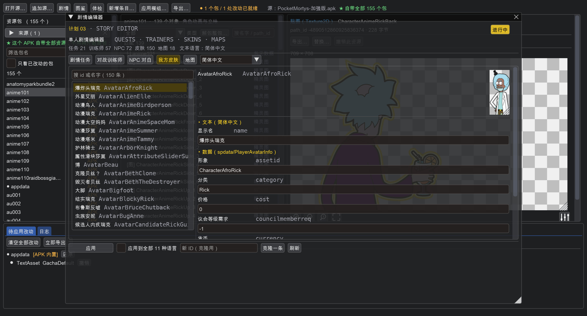

# 单人剧情编辑器

工具栏「**剧情**」打开。改的是游戏的单人剧情：任务对白、对战训练师、
我方皮肤、地图。


## 剧情数据在哪

游戏把单机剧情拆在**两个地方**，改的时候两边都得动：

| 内容 | 数据表（`spdata`） | 文本（`text/<语言>`） |
|---|---|---|
| 剧情任务 | `QuestInfo` | `Quest` |
| 对战训练师 | `TrainerInfo`（队伍 + 奖励） | `Trainer`（战前/战后对白） |
| NPC | `NPCInfo` | `NPC` |
| 我方皮肤 | `PlayerAvatarInfo` | `PlayerAvatar` |
| 地图 | `WorldInfo` | `Dimensions` |
| 传送门 / 场景互动 | `InteractionInfo` | `Interactions` |
| 路牌 | `SignPostInfo` | `SignPost` |
| 锦标赛对白 | `TournamentDialogueInfo` | `TournamentDialogue` |

**只改一边没用**：把 `QuestInfo` 的奖励改了但 `text/Quest` 的对白没改，
游戏里就是「对白说给你三个芯片，实际给了一个」这种错位。

实测（加强版）：剧情任务 **21** 个、对战训练师 **57** 个、NPC **72** 个、
我方皮肤 **150** 个、地图 **18** 张，文本有 **11 种语言**。

## 剧情任务

一个任务有 **7 段文本**，全部可以在界面里改：

```
任务名       为最高统帅效劳
给予者       总统
任务描述     总统需要瑞克给他Fleeb
进行中对白   小声点！没人知道我在这里。现在快把那Fleeb给我。
交不齐时的   瑞克，请务必给我Fleeb。那不是Fleeb。
完成时       瑞克，你为国争光了。为表示感谢，请收下这些莫蒂操纵芯片。
交付后       瑞克，你为国争光了
```

下面还有数据表那几个字段（徽章需求、需要的物品、给予者形象…）。

## 对战 NPC


左边 57 个训练师，右边是它的 **3 段战前对白 + 1 段战后对白**，
再下面是**出场队伍编辑器**：

```
▸ 出场队伍  TEAM
  换一只莫蒂就是换形象；等级也在这里调

  1.  [量子莫蒂 · MortyExoAlpha  ▾]  等级 [6]
  2.  [幽灵莫蒂 · MortySpooky    ▾]  等级 [6]
  [+ 加一只]
  队伍写法：MortyExoAlpha:6,MortySpooky:6
```

**「对方皮肤」就是这么换的**：队伍里放哪只莫蒂，出场就是哪只的形象。
等级也在这里调 —— 想做「一场硬仗」就把等级拉高。

队伍写法是 `莫蒂id:等级` 逗号分隔，和游戏里存的一模一样，
所以从别处抄一份队伍过来直接粘也行。

## 我方皮肤



150 个玩家形象（`AvatarRickDefault`、`AvatarAnimeRick`…），
右边能看形象图，能改显示名、形象资产、分类、价格、货币、议会等级需求。

## 地图


18 张地图的尺寸（`segmentwidth` × `segmentdepth`）、材质主题、
节点集、镜头边界、节点上限都在这里。

## 批量改文本

底部有两个开关：

- **应用到全部 11 种语言** —— 勾上之后，你填的中文会被写进全部语言。
  自己做着玩的话这样最省事（别的语言反正也看不懂）；要给别人用就
  一种一种改。
- **克隆一条** —— 填个新 ID，从选中的那条复制一份（文本 + 数据表一起复制）。

## 剧情体检

`story.validate()` 会查剧情表和文本对不对得上：

```
⚠ NPC 对白：1 个条目在 text/ZH_CN.NPC 里没有文本（例如 NPCMovingMortysJerry）
   —— 游戏里会显示成 ID
⚠ 训练师 TrainerXxx 的队伍里有不存在的莫蒂 MortyNope
```

这两个都会让游戏里显示成 ID 或者直接出错，所以在改剧情之前先跑一遍比较稳。
