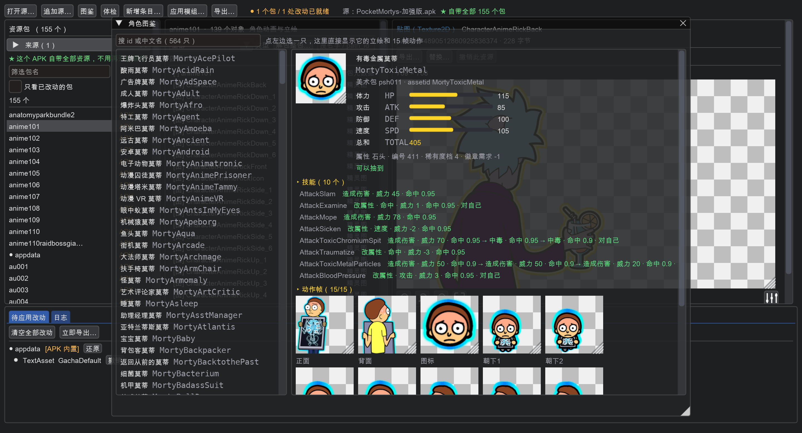
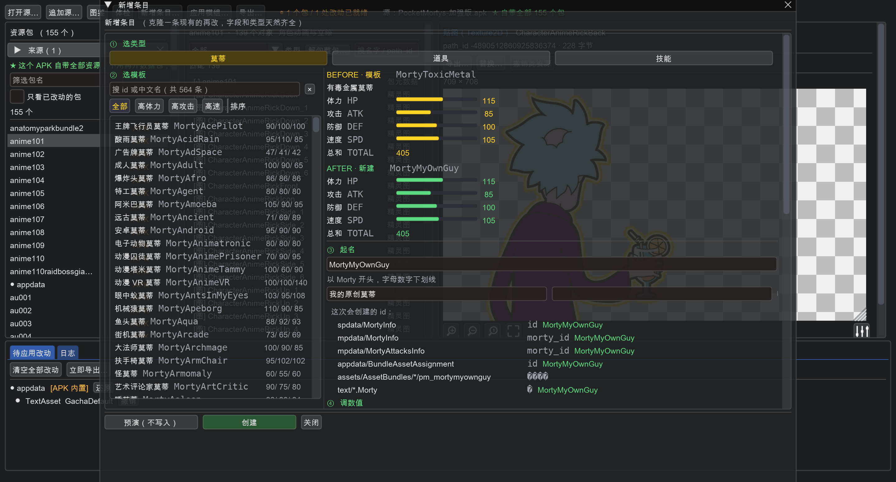

# 新增莫蒂 / 道具 / 技能

怎么往游戏里**加**一条新东西（不是改现有的，是真新增）。

图形界面：「**新增条目…**」按钮（或菜单「模组 → 新增莫蒂 / 道具 / 技能…」）。
命令行：`tools/cli.py add-entry`。

> **字段看不懂？** 界面里每个字段都带中文名和取值含义，
> 也可以按菜单「**帮助 → 字段中英文对照…**」查全部对照表，
> 或者直接看本文档的[字段对照表](#字段对照表看不懂字段名来这查)。

---

## 目录

- [先说结论：为什么是「克隆」](#先说结论为什么是克隆)
- [加一只莫蒂要同时改 5 处](#加一只莫蒂要同时改-5-处)
- [图形界面怎么用](#图形界面怎么用)
- [命令行怎么用](#命令行怎么用)
- [美术从哪来](#美术从哪来)
- [编号、本地化、抽卡池](#编号本地化抽卡池)
- [做完之后](#做完之后)
- [限制](#限制)
- [字段对照表（看不懂字段名来这查）](#字段对照表看不懂字段名来这查)

---

## 先说结论：为什么是「克隆」

这些表是**游戏逻辑直接吃**的，字段一个都不能少、类型也不能错。凭空造一条很容易
漏字段 —— 进游戏轻则隐身、重则崩溃。

所以工具的做法是：

1. 你挑一条**现有的**当模板（比如 `MortyDefault`）
2. 工具深拷贝它（连同所有字段）
3. 只改 id、编号、名字
4. 写回

**字段天然齐全、类型天然正确**，这是唯一可靠的做法。

> 所以界面上第一件事就是让你「复制自」哪一条。选一个**和你想要的最接近**的
> 现有条目当模板，改起来最省事。

---

## 加一只莫蒂要同时改 5 处

这是最容易踩的坑：**只改一张表是不够的**。同一个逻辑表在 `spdata` 和 `mpdata`
里格式还不一样：

| # | 位置 | 格式 | 少了会怎样 |
|---|---|---|---|
| ① | `spdata/MortyInfo` | **dict**，字段是**字符串**（`number` 是 `"565"`），技能是一长串 `"AttackA:1, AttackB:6"` | 单机模式看不到 |
| ② | `mpdata/MortyInfo` | **list**，字段**有类型**（`number` 是 `565`，`morty_id`/`asset_id`） | **联机对战看不到** |
| ③ | `mpdata/MortyAttacksInfo` | list，`attacks` 是 `[{attack_id, level}]` | 没技能可学 |
| ④ | `appdata/BundleAssetAssignment` | assetid → 它住在哪个资源包 | **形象空白** |
| ⑤ | `text/<11 种语言>` | `Morty` 段下 `{name, description, characteristic}` | 名字显示成 key 或空白 |

工具会**一次性全改**，`add-entry` 的输出里会逐条列出来：

```
✓ 新增莫蒂 MortyCoolRick（模板 MortyDefault）
  spdata/MortyInfo：新增 MortyCoolRick（编号 565）
  mpdata/MortyInfo：新增 MortyCoolRick（编号 565）
  mpdata/MortyAttacksInfo：新增 MortyCoolRick
  appdata/BundleAssetAssignment：沿用 MortyBigBrain（anatomyparkbundle2）
  text/Morty：11 种语言的条目（EN/ZH_CN 写了新名字，其余沿用模板）
  appdata/GachaDefault：加进第 1 个卡池（GachaSPProduct1）
```

道具和技能同理，只是表少一些：

| 类型 | 要改的表 |
|---|---|
| 道具 | `spdata/ItemInfo`、`mpdata/ItemInfo`、`text/*.Item` |
| 技能 | `spdata/AttackInfo`、`mpdata/AttackInfo`、`text/*.Attack` |

（道具想能**合成**的话，还要加 `spdata/RecipeInfo` + `mpdata/RecipeInfo`，
本工具暂不代劳，可以之后用「编辑文本」自己加。）

---

## 图形界面怎么用

点工具栏「**新增条目…**」：

```
┌─ 新增条目（莫蒂 / 道具 / 技能）──────────────────────┐
│ 做法：克隆一条现有的再改 → 字段和类型天然齐全          │
│                                                      │
│ [莫蒂 ▾]  类型：莫蒂                                  │
│ 搜模板                                                │
│ [按 id 或中文名筛选（共 564 条）              ]       │
│ 复制自（模板）                                        │
│ [MortyDefault  莫蒂                          ▾]      │
│ ────────────────────────────────────────────────     │
│ 新 ID                                                 │
│ [MortyMyCustom                                ]       │
│   建议以 Morty 开头，只能用字母数字下划线              │
│ 中文名                    英文名                       │
│ [我的莫蒂            ] []                             │
│ 描述                                                  │
│ [                                              ]      │
│ 借用美术（assetid）                                   │
│ [MortyDefault                                ▾]      │
│ ▶ 字段（继承自模板，可改）                            │
│ ☐ 同时加进抽卡池                                      │
│ [预演（不写入）] [创建] [关闭]                        │
└──────────────────────────────────────────────────────┘
```

步骤：

1. 选**类型**（莫蒂 / 道具 / 技能）
2. 「搜模板」可以按 id **或中文名**筛选 —— 输入「血清」就能找到 `ItemSerum`
3. 选「复制自」
4. 填**新 ID**（只能用字母数字下划线，以字母开头；不能和现有的重名）
5. 填**中文名 / 英文名 / 描述**
6. 「借用美术」选一个已存在的 assetid（见下一节）
7. 展开「**字段（继承自模板，可改）**」改数值 —— 这里列的是主表的**全部字段**，
   莫蒂的话就是 `hpbase`/`attackbase`/`defencebase`/`speedbase`/`attacks` 等
8. 想让它抽得到，勾「同时加进抽卡池」并选卡池
9. 先点「**预演（不写入）**」看看会改哪些表，没问题再点「**创建**」

创建后，改动会进「待应用改动」，然后照常「导出…」出产物。

> `stattotal`（种族值总和）会**自动**按 生命+攻击+防御+速度 重算，不用手填。
> 编号（`number`）也自动取全表最大值 +1，spdata 和 mpdata 会保持一致。

---

## 命令行怎么用

```bash
# 先看看有哪些类型、各多少条
python3 tools/cli.py entries 口蘑数据包.zip

# 想连条目名一起看
python3 tools/cli.py entries 口蘑数据包.zip --show --limit 40

# 加一只莫蒂
python3 tools/cli.py add-entry 口蘑数据包.zip \
    --kind morty \
    --id MortyCoolRick \
    --from MortyDefault \
    --name "酷里克莫蒂" --en-name "Cool Rick Morty" \
    --desc "用工具加出来的新莫蒂" \
    --assetid MortyBigBrain \
    --gacha 0 \
    --set spdata/MortyInfo.hpbase=88 \
    --set spdata/MortyInfo.attackbase=92 \
    --set spdata/MortyInfo.defencebase=70 \
    --set spdata/MortyInfo.speedbase=85 \
    --modpack 新增莫蒂.pmmod --mod-name "新增莫蒂示例" \
    -o 产物 --mode cache

# 加一个道具
python3 tools/cli.py add-entry 口蘑数据包.zip \
    --kind item --id ItemSuperSerum --from ItemSerum \
    --name "超级血清" --desc "恢复 999 点体力" \
    --set spdata/ItemInfo.cost=0 --set spdata/ItemInfo.effectvalue=999 \
    --set mpdata/ItemInfo.cost=0 --set mpdata/ItemInfo.effect_value=999 \
    --modpack 超级血清.pmmod -o 产物

# 加一个技能
python3 tools/cli.py add-entry 口蘑数据包.zip \
    --kind attack --id AttackMegaZap --from AttackOutburst \
    --name "超级电击" --modpack 超级电击.pmmod -o 产物

# 只预演，不写入
python3 tools/cli.py add-entry 口蘑数据包.zip --kind morty \
    --id MortyTest --from MortyDefault --dry-run
```

参数说明：

| 参数 | 作用 |
|---|---|
| `--kind` | `morty` / `item` / `attack` |
| `--id` | 新条目的 id |
| `--from` | 克隆哪一条做模板 |
| `--name` / `--en-name` / `--desc` | 文案（写进中英；`--langs` 可改） |
| `--langs` | 新名字写进哪几种语言，默认中文 + 英文 |
| `--set 表.字段=值` | 覆盖字段，可重复。表名就是输出里那个（如 `spdata/MortyInfo`） |
| `--assetid` | 借用哪个已存在的美术资源（默认沿用模板的） |
| `--gacha N` | 顺便加进第 N 个卡池（从 0 数） |
| `--dry-run` | 只预演 |
| `--modpack` | 顺便导出成 `.pmmod` |
| `--mode` | 产物形式：`cache`（默认）/ `cdn` / `bundles` / `all` / `none` |

> `--set` 的字段名用**主表**的字段名就行。`mpdata` 那边的字段名不一样
> （比如 `item_id` vs `id`），但因为是克隆的，不改也没关系；
> 真要改 mpdata 的字段，`--set mpdata/ItemInfo.xxx=...` 即可。

---

## 美术从哪来

新条目通过 **`assetid`** 决定用哪套图。三种情况：

| 情况 | 做法 | 结果 |
|---|---|---|
| **沿用模板的图** | 不填 `--assetid` | 新莫蒂长得和模板一样（换数值的「换皮」） |
| **借另一只的图** | `--assetid MortyBigBrain` | 用 `MortyBigBrain` 的形象 |
| **想要独一无二的图** | ❌ 本工具不支持 | 需要往资源包里**新增** Sprite/Texture2D 对象，是另一个量级的工作 |

第二种情况，`assetid` 指向的必须是**已经存在**的资源。工具会帮你：

- 在 `spdata`/`mpdata` 的行里把 `assetid`/`asset_id` 改成目标值
- 如果该 assetid 在 `BundleAssetAssignment` 里没有记录，会补一条（沿用模板所在的包）
- 如果补了记录，会给出**警告**提醒你自己确认那个资源真的存在

> ⚠️ 如果你填了一个 `BundleAssetAssignment` 里没有的 assetid，而资源包里也确实
> 没有这个资源，游戏里就是**空白/隐身**。工具会提示，但没法替你验证。

**实用建议**：先挑一个形象你想要的现有莫蒂，把它的 `assetid` 抄过来。
等于「借皮」——数值是你自己定的，样子是它的。

---

## 编号、本地化、抽卡池

**编号**：自动取全表最大值 +1，`spdata` 的 `number`（字符串）和 `mpdata` 的
`number`（整数）保持一致。当前莫蒂编号到 564，所以新增的会是 565。

**本地化**：11 种语言全部写入。你给了名字的语言用你的名字，**没给的语言沿用
模板的文案**（不会变成空白，只是暂时显示模板的名字）。想补别的语言：

```bash
--langs ZH_CN ZH_TW JP --name 我的莫蒂
```

或者事后在图形界面里直接编辑 `text` 包对应的 TextAsset。

**抽卡池**：游戏里能否抽到由 `MortyInfo.includeingacha` 字段决定（克隆时继承了
模板的值）。勾「同时加进抽卡池」会额外往指定卡池的 `gacha_content` 里加一条
`{"quantity":1, "reward":"MORTY", "parameters":{"ids":["新ID"]}}`，
让它在那个池子里**必定能出**。

> 当前有 3 个卡池：`GachaSPProduct1` / `GachaSPProduct2` / `GachaSPProduct3`。

---

## 做完之后

和普通模组一样，走「导出…」：

```bash
# 出 UnityCache 产物，推到设备（不用重装 APK）
python3 tools/cli.py add-entry 口蘑数据包.zip --kind morty ... -o 产物 --mode cache
cd 产物/UnityCache产物 && ./push.sh

# 或者顺便导出成 .pmmod 分享给别人
python3 tools/cli.py add-entry 口蘑数据包.zip --kind morty ... \
    --modpack 新增莫蒂.pmmod -o 产物 --mode none
```

`.pmmod` 怎么给别人用，见 [pmmod使用说明.md](pmmod使用说明.md)。

> 一个新增莫蒂的模组包通常 **3~5 MB**（因为要带上 11 种语言的整张本地化表）。
> 想小一点可以 `--langs ZH_CN` 只改中文，但其它语言的表仍要写（沿用模板文案），
> 所以体积差别不大。

现成的例子见 [examples/3-新增莫蒂/](../examples/3-新增莫蒂/recipe.json)。

---

## 限制

- **不能新增美术**：新条目的 `assetid` 只能指向已存在的资源，做不到「上传一张图
  就变成新莫蒂」。要做这个得往资源包里构造 Sprite/Texture2D，未实现。
- **不能新增进化链**：`evolution` / `evolution_req` 字段是克隆来的，指向原来的
  进化对象。要让新莫蒂能进化，得手动改这两个字段并保证目标存在。
- **没在真机验证过**：工具在这一端能保证的是**数据结构完整、类型正确、五处联动
  齐全、回写后能重新读出来**。游戏里实际表现（尤其是新莫蒂的贴图、战斗数值、
  图鉴排序）需要你上机确认。
- **道具合成表要自己加**：`RecipeInfo` 不在自动流程里。

---

## 字段对照表（看不懂字段名来这查）

游戏数据表里的字段名全是英文技术标识。这里是从**真实数据里统计出来的**对照 ——
取值那列不是猜的，是把 564 条莫蒂、44 个道具全扫一遍得到的。

图形界面里也有同一份：菜单「**帮助 → 字段中英文对照…**」，
或者直接在「新增条目」窗口展开「字段（中英文对照，可改）」，
每个字段上面就是中文名。

> **常改** = 平时最常调的几个（界面上打 ★）；**自动** = 工具会自动重算，手改没用。


### `appdata/GachaDefault`

*全局配置（抽卡掉率、资源归属） · GachaDefault*

| 字段 | 中文 | 说明 | 取值 |
|---|---|---|---|
| `drop_rates` | 掉率 | 按档位的权重，例如 [80,12,6,2] 表示各档占比 |  |
| `gacha_promo_chance` | 促销概率 | -1 表示关闭 |  |
| `gacha` | 卡池列表 | 每个池子有 gacha_id / cost / gacha_content |  |

### `mpdata/AttackInfo`

*联机数据表（和单机表格式不同，两边都要改） · AttackInfo*

| 字段 | 中文 | 说明 | 取值 |
|---|---|---|---|
| `attack_id` | 内部 ID | 必须和单机表一致 |  |
| `pp_stat` | 可用次数（常改） | -1 表示无限 |  |
| `element` | 属性 | null 或 Rock/Paper/Scissors | `(空)`=无属性，`None`=无属性，`Rock`=石头，`Paper`=布，`Scissors`=剪刀 |
| `effects` | 效果（常改） | 结构：每条是 {type/power/accuracy/to_self} 的对象 |  |

### `mpdata/ItemInfo`

*联机数据表（和单机表格式不同，两边都要改） · ItemInfo*

| 字段 | 中文 | 说明 | 取值 |
|---|---|---|---|
| `item_id` | 内部 ID | 必须和单机表一致 |  |
| `asset_id` | 美术 ID | 必须和单机表一致 |  |
| `type` | 类别 |  | `ITEM`=道具（直接用），`PART`=零件（合成材料） |
| `cost` | 价格 | 整数 |  |
| `store_level` | 上架等级 | 商店解锁等级 |  |
| `reward_level_lower` | 奖励等级下限 |  |  |
| `reward_level_upper` | 奖励等级上限 |  |  |
| `effect_type` | 效果类型 |  | `(空)`=无，`RestoreHP`=回复体力，`RestorePP`=回复技能次数，`StatIncrease`=提升能力，`Cure`=治疗异常状态，`Revive`=复活，`Capture`=捕捉野生莫蒂，`DamageHP`=直接扣体力，`ShinyPotion`=闪光药水（推测） |
| `effect_stat` | 作用项 |  | `(空)`=无，`All`=全部能力，`Attack`=攻击，`Defence`=防御，`Speed`=速度，`Level`=等级，`Poison`=中毒，`Paralysis`=麻痹 |
| `use_world` | 世界可用 |  | `TRUE`=是，`FALSE`=否，`true`=是，`false`=否 |
| `use_craft` | 合成可用 |  | `TRUE`=是，`FALSE`=否，`true`=是，`false`=否 |
| `use_battle` | 战斗可用 |  | `TRUE`=是，`FALSE`=否，`true`=是，`false`=否 |
| `use_self` | 对自己用 |  | `TRUE`=是，`FALSE`=否，`true`=是，`false`=否 |
| `use_account` | 账号级使用 | 推测：用了对账号全局生效 |  |
| `attacker_animation` | 攻击方动画 |  |  |
| `defender_animation` | 受击方动画 |  |  |
| `sortorder` | 排序（自动） | 整数 |  |
| `in_gacha` | 能抽到 |  | `TRUE`=是，`FALSE`=否，`true`=是，`false`=否 |
| `mp_premium_cost` | 联机高级价格 | 推测 |  |

### `mpdata/MortyAttacksInfo`

*联机数据表（和单机表格式不同，两边都要改） · MortyAttacksInfo*

| 字段 | 中文 | 说明 | 取值 |
|---|---|---|---|
| `morty_id` | 内部 ID | 对应 MortyInfo 里的 id |  |
| `attacks` | 技能学习表 | 结构：每条是 {attack_id: 技能ID, level: 学会等级} |  |

### `mpdata/MortyInfo`

*联机数据表（和单机表格式不同，两边都要改） · MortyInfo*

| 字段 | 中文 | 说明 | 取值 |
|---|---|---|---|
| `morty_id` | 内部 ID | 必须和单机表里的 id 完全一致 |  |
| `asset_id` | 美术 ID | 必须和单机表里的 assetid 一致 |  |
| `number` | 图鉴编号（自动） | 整数，和单机表保持一致 |  |
| `gender` | 性别 |  | `MALE`=雄性，`FEMALE`=雌性，`GENDERLESS`=无性别 |
| `height` | 身高 | 展示文本 |  |
| `weight` | 体重 | 展示文本 |  |
| `division` | 档位 | 整数（单机表那边是字符串） | `1`=第 1 档，`2`=第 2 档，`3`=第 3 档，`4`=第 4 档 |
| `element` | 属性 | null 或 Rock/Paper/Scissors | `(空)`=无属性，`None`=无属性，`Rock`=石头，`Paper`=布，`Scissors`=剪刀 |
| `evolution_req` | 进化条件 | null 表示不进化 |  |

### `mpdata/RecipeInfo`

*联机数据表（和单机表格式不同，两边都要改） · RecipeInfo*

| 字段 | 中文 | 说明 | 取值 |
|---|---|---|---|
| `recipe_id` | 配方 ID |  |  |
| `sortorder` | 排序（自动） |  |  |
| `item_id_1` | 材料 1 |  |  |
| `item_id_2` | 材料 2 |  |  |
| `item_id_3` | 材料 3 |  |  |
| `item_id_result` | 产物 |  |  |

### `spdata/AttackInfo`

*单机数据表（莫蒂、技能、道具、任务、世界…） · AttackInfo*

| 字段 | 中文 | 说明 | 取值 |
|---|---|---|---|
| `id` | 内部 ID | 不能和现有的重复 |  |
| `elementtype` | 属性 | 石头剪子布 | `(空)`=无属性，`None`=无属性，`Rock`=石头，`Paper`=布，`Scissors`=剪刀 |
| `pp` | 可用次数（常改） | -1 表示无限次 |  |
| `effects` | 效果（常改） | 格式：{Type:Hit, Power:50, Accuracy:0.95}，多条用逗号分隔。Type 常见 Hit（造成伤害）；Power 威力；Accuracy 命中率(0~1)；ToSelf:true 表示作用在自己身上 |  |

### `spdata/ItemInfo`

*单机数据表（莫蒂、技能、道具、任务、世界…） · ItemInfo*

| 字段 | 中文 | 说明 | 取值 |
|---|---|---|---|
| `id` | 内部 ID | 不能和现有的重复 |  |
| `assetid` | 美术 ID | 图标用哪套图 |  |
| `type` | 类别 | 道具还是合成材料 | `ITEM`=道具（直接用），`PART`=零件（合成材料） |
| `cost` | 价格（常改） | 商店售价 |  |
| `displayorder` | 排序（自动） | 商店/背包里的排列顺序 |  |
| `purchasebadgereq` | 购买需徽章 | 0 表示无要求 |  |
| `spbaglimit` | 背包上限（常改） | 最多能带几个 |  |
| `rewardbadgereq` | 奖励需徽章 | 作为奖励发放时的门槛 |  |
| `rarity` | 稀有度（常改） | 数值越大越稀有 |  |
| `includeingacha` | 能抽到 |  | `TRUE`=是，`FALSE`=否，`true`=是，`false`=否 |
| `effecttype` | 效果类型（常改） | 这道具做什么 | `(空)`=无，`RestoreHP`=回复体力，`RestorePP`=回复技能次数，`StatIncrease`=提升能力，`Cure`=治疗异常状态，`Revive`=复活，`Capture`=捕捉野生莫蒂，`DamageHP`=直接扣体力，`ShinyPotion`=闪光药水（推测） |
| `effectvalue` | 效果数值（常改） | 配合效果类型，例如回复多少点体力 |  |
| `effectstattype` | 作用项 | 提升/治疗哪个能力或异常 | `(空)`=无，`All`=全部能力，`Attack`=攻击，`Defence`=防御，`Speed`=速度，`Level`=等级，`Poison`=中毒，`Paralysis`=麻痹 |
| `usableinworld` | 世界可用 | 在探索地图上能不能用 | `TRUE`=是，`FALSE`=否，`true`=是，`false`=否 |
| `usableincraft` | 合成可用 | 能不能当合成材料 | `TRUE`=是，`FALSE`=否，`true`=是，`false`=否 |
| `usableinbattle` | 战斗可用 | 战斗中能不能用 | `TRUE`=是，`FALSE`=否，`true`=是，`false`=否 |
| `useonself` | 对自己用 | 是给自己还是给对面 | `TRUE`=是，`FALSE`=否，`true`=是，`false`=否 |
| `attackeranimation` | 攻击方动画 | 动画 ID，一般留空 |  |
| `defenderanimation` | 受击方动画 | 例：CaptureGun |  |
| `battlepoints` | 战斗点数 | 一般留空 |  |

### `spdata/MortyInfo`

*单机数据表（莫蒂、技能、道具、任务、世界…） · MortyInfo*

| 字段 | 中文 | 说明 | 取值 |
|---|---|---|---|
| `id` | 内部 ID | 游戏认这个。只能用字母数字下划线，且不能和现有的重复 |  |
| `assetid` | 美术 ID | 决定用哪套图。填已存在的资源才会显示形象 |  |
| `number` | 图鉴编号（自动） | 图鉴里的序号，自动取最大值 +1 |  |
| `gender` | 性别 | 影响外观文案 | `MALE`=雄性，`FEMALE`=雌性，`GENDERLESS`=无性别 |
| `evolution` | 进化成 | 填另一只莫蒂的 ID；留空表示不进化 |  |
| `evolutiontier` | 进化阶段 | 1 = 初始形态，2/3… = 进化几次 |  |
| `height` | 身高 | 只是展示文本，随便写，例如 5'2" |  |
| `weight` | 体重 | 只是展示文本，例如 110.2 lbs |  |
| `badgereq` | 需要徽章 | -1 表示无要求；正数表示要拿到对应数量的徽章才能用 |  |
| `division` | 档位 | 稀有度分档，抽卡按档位给 | `1`=第 1 档，`2`=第 2 档，`3`=第 3 档，`4`=第 4 档 |
| `includeingacha` | 能抽到 | 是否进随机抽卡池 | `TRUE`=是，`FALSE`=否，`true`=是，`false`=否 |
| `elementtype` | 属性 | 石头剪子布三系相克 | `(空)`=无属性，`None`=无属性，`Rock`=石头，`Paper`=布，`Scissors`=剪刀 |
| `defeatedxp` | 击败经验（常改） | 打败它给多少经验 |  |
| `hpbase` | 体力种族值（常改） | 越高越耐打 |  |
| `attackbase` | 攻击种族值（常改） | 越高打得越疼 |  |
| `defencebase` | 防御种族值（常改） | 越高越抗打 |  |
| `speedbase` | 速度种族值（常改） | 越高越先出手 |  |
| `stattotal` | 种族值总和（自动） | 自动按 体力+攻击+防御+速度 重算，不用手填 |  |
| `attacks` | 技能学习表（常改） | 格式：技能ID:等级，逗号分隔。例：AttackOutburst:1, AttackCry:6 |  |

### `spdata/RecipeInfo`

*单机数据表（莫蒂、技能、道具、任务、世界…） · RecipeInfo*

| 字段 | 中文 | 说明 | 取值 |
|---|---|---|---|
| `id` | 配方 ID |  |  |
| `number` | 排序（自动） |  |  |
| `slot1` | 材料 1 | 道具 ID |  |
| `slot2` | 材料 2 | 道具 ID |  |
| `slot3` | 材料 3 | 道具 ID |  |
| `resultid` | 产物 | 合成出来的道具 ID |  |

### 取值速查

| 字段 | 取值 |
|---|---|
| 性别 `gender` | `MALE` 雄性 / `FEMALE` 雌性 |
| 属性 `elementtype` | `Rock` 石头 / `Paper` 布 / `Scissors` 剪刀 / 空 = 无属性 |
| 是否 `includeingacha` 等 | `TRUE` 是 / `FALSE` 否（联机表里写成 `true`/`false`） |
| 道具类别 `type` | `ITEM` 道具（直接用）/ `PART` 零件（合成材料） |
| 效果类型 `effecttype` | `RestoreHP` 回复体力 / `RestorePP` 回复技能次数 / `StatIncrease` 提升能力 / `Cure` 治疗异常 / `Revive` 复活 / `Capture` 捕捉 / `DamageHP` 直接扣体力 |
| 作用项 `effectstattype` | `All` 全部 / `Attack` 攻击 / `Defence` 防御 / `Speed` 速度 / `Level` 等级 / `Poison` 中毒 / `Paralysis` 麻痹 |
| 档位 `division` | 1~4，数字越大越稀有 |

**技能效果串**（`spdata/AttackInfo` 的 `effects`）格式：

```
{Type:Hit, Power:50, Accuracy:0.95}
 ↑效果类型  ↑威力      ↑命中率(0~1)
```

多条用逗号分隔，例如 `AttackStruggle` 是：

```
{Type:Hit, Power:25},{Type:Hit, Power:20, ToSelf:true}
```

`ToSelf:true` = 这个效果作用在自己身上。


---

## 完全新增一个角色（连美术一起造）

前面说的 `add_entry` 是「克隆一条数据 + **借用**别人的形象」。如果你要的是
**真·全新角色**——有自己独立的 15 张图、想怎么画怎么画——用这个：

```bash
python3 tools/cli.py add-character 口蘑数据包.zip \
    --id MortyMyOwnGuy \
    --from MortyToxicMetal \
    --name "我的原创莫蒂" \
    --image Icon=图标.png --image Front=正面.png \
    --set spdata/MortyInfo.hpbase=150 \
    --gpu          # 不是这个参数，见下面
```

图形界面在「新增条目」窗口里勾 **「连美术一起造（完全新增角色，不是借皮）」**。

### 它到底做了什么

游戏找一只莫蒂的图是**按固定路径**查的：

```
assets/resourceassetbundles/<包名>/morties/<assetid 小写>/<assetid 小写><动作>.png
```

`<动作>` 一共 **15 帧**，实测全表 564 只莫蒂完全一致：

| 方向 | 帧 |
|---|---|
| 立绘 | `Back`（背面）、`Front`（正面）、`Icon`（图鉴图标） |
| 朝下 | `Down_1` `Down_2` `Down_3` `Down_4` |
| 朝侧 | `Side_1` `Side_2` `Side_3` `Side_4` |
| 朝上 | `Up_1` `Up_2` `Up_3` `Up_4` |

每个动作在包里对应**一对同名对象**：一个 `Sprite` + 一个 `Texture2D`（1:1，
**不是共享图集** —— 所以换图不会连累别的角色）。

`add-character` 会：

1. 复制模板所在的**整个包**
2. 把 `<模板assetid><动作>` 这 **30 个对象**（15 精灵 + 15 贴图）改名为 `<新assetid><动作>`
3. 重写包内 `m_Container` 的 **30 条资源路径**（全小写，和新名字对应）
4. 用你给的图替换指定帧（没给的沿用模板）
5. 存成**新包** `<新包名>.assetbundle`，以**不压缩**方式写进 APK
6. 在新包所在的 APK 里登记三处：
   - `assets/AssetBundles/Android/<新包>.assetbundle`（新文件）
   - `manifest.json`（加一条 `{id, version:"1", crc, url}`）
   - `assets/pmseed/index.txt`（加一行 `<新包> <目录名>`）
7. `BundleAssetAssignment[新assetid] = {id, version: <新包>}`
8. 最后照常写莫蒂的 5 张表

**原角色一点没动**，新角色是完全独立的一份。

### 挑模板

**优先挑「只装一只角色」的包**，否则新包会把同包里别的角色也复制一份
（只是不引用，纯粹占体积）。工具会在预演时提醒你：

```
⚠ 模板所在的包 preload 是**共享包**，里面还有 4 只别的角色
  （MortyBaby、MortyMustache、MortyScruffy、MortyStrayCat…），新包会把它们也复制一份。
  想要干净的话，换一只装在「单角色包」里的模板，例如 psh011 / tg016 那种。
```

怎么找单角色包：

```bash
python3 tools/cli.py list 口蘑数据包.zip | grep -E "^(psh|tg)"
```

经验上 `psh*` / `tg*` 这类包多数只装一只。

### 换具体某一帧的图

`--image 帧=文件` 可以给多次；也可以创建完之后，在图形界面里打开新包
（`pm_xxx`）用「替换…」逐帧换。尺寸不一致会自动缩放到原尺寸。

### 实测

```
✓ 完全新增角色 MortyMyOwnGuy（模板 MortyToxicMetal）
  美术：psh011 里的 MortyToxicMetal（15 帧） → 新包 pm_mortymyownguy 里的 MortyMyOwnGuy
  改名对象 30 个，容器路径 30 条
  替换了 2 帧图：Icon、Front
  新增 APK 条目 assets/AssetBundles/Android/pm_mortymyownguy.assetbundle（152,843 字节）
  manifest.json 登记 pm_mortymyownguy（v1）
  播种表登记 pm_mortymyownguy → 00000000000000000000000001000000
  BundleAssetAssignment：MortyMyOwnGuy → pm_mortymyownguy
  spdata/MortyInfo：新增 MortyMyOwnGuy（编号 565）
  mpdata/MortyInfo：新增 MortyMyOwnGuy（编号 565）
  mpdata/MortyAttacksInfo：新增 MortyMyOwnGuy
  text/Morty：11 种语言的条目
```

`MortyAyin` 那种「复制一条只改键」的手工改法会踩的坑，这个流程全都避开了。

### 限制

- 只能**复制现有角色的动画结构**（15 帧那套），不能发明新的动作
- 新包名会带 `pm_` 前缀，一眼能认出来是工具加的
- **需要重打包 APK**（往 APK 里加了新文件），UnityCache 单路产物盖不住新增的包
  —— 所以这条路的产物是「新的 APK」，装上即生效

---

## 为什么游戏进不去：数据表体检

**最常见的原因：主键重复。**

游戏把 `MortyInfo` 读进内存后会按主键建字典。**主键重复**在 C# 里是
`ArgumentException: An item with the same key has already been added` —— 直接崩，
表现就是「游戏进不去」。而这些错**手工改 JSON 时极容易犯**，而且从文件上看
完全正常。

最典型的一种：**复制一条现成的莫蒂来改，只改了字典的键和本地化里的名字，
忘了改记录内部的 `id` 字段**：

```json
"MortyAyin": {          // ← 键改了
  "id": "MortyGotron",  // ← 里面没改，于是 MortyGotron 出现了两次
  "number": "422",      // ← 编号也跟着重复
  ...
}
```

### 工具现在会拦

**出任何产物之前自动体检**，有致命问题直接拦住：

```
✗ 数据表里有 4 个**会让游戏崩**的问题，先修再出 APK。
  命令行： tools/cli.py check <源>      看详情
          tools/cli.py fix   <源>      自动修
  图形界面：工具栏「体检」按钮。
```

自己查 / 自己修：

```bash
python3 tools/cli.py check 加强版.apk          # 看有哪些问题
python3 tools/cli.py fix   加强版.apk -v       # 看打算怎么修（预演）
python3 tools/cli.py fix   加强版.apk --apk 加强版.apk --apk-out 修好的.apk
```

图形界面：工具栏「**体检**」按钮；网页版：顶部那个体检徽标，点一下就能修。

### 检查项

**E 级（会让游戏崩 / 行为不一致）**：

1. dict 表：键与记录内 `id` 不一致
2. list 表：主键重复
3. 莫蒂编号重复
4. 技能表里 `morty_id` 重复
5. **技能效果单机表和联机表对不上**

**W 级（不会立刻崩，但功能不对）**：

5. `spdata` 有、`mpdata` 没有 → 联机看不到
6. `spdata` 有、技能表没有 → 学不到技能
7. 本地化缺条目 → 名字显示成 key
8. `assetid` 没在 `BundleAssetAssignment` 登记 → 形象空白
9. `attacks` 引用了不存在的技能
10. `evolution` 指向不存在的莫蒂

### 自动修能修什么

- 键 ≠ 记录内 id → 把记录内 id 改成键（以本地化的键为准，那通常是你想要的）
- 编号重复 → 重新分配一个没被占用的编号
- list 表主键重复 → 删掉后出现的那条
- `mpdata` / 技能表缺条目 → 从 `spdata` 那条派生出来补上
- 本地化缺条目 → 补占位
- `assetid` 没登记 → 补一条（**version 要你自己填对**，否则还是空白）


---

## 界面

「新增条目」是**左右两栏**，左边挑模板、右边填参数，不用一直在那滚：

```
新增条目（克隆一条现有的再改，字段和类型天然齐全）
① 选类型   [莫蒂] [道具] [技能]

┌ ② 选模板 ────────────┐ ┌ 右栏 ──────────────────────────────┐
│ 搜 id 或中文名  [×]  │ │ BEFORE · 模板  MortyToxicMetal     │
│ [全部][高体力][高攻击]│ │  体力 HP ████████  115             │
│ [高速]      排序 ▾   │ │  总和 TOTAL        405             │
│ ┌──────────────────┐ │ │ AFTER · 新建  MortyMyOwnGuy        │
│ │ 王牌飞行员莫蒂    │ │ │  体力 HP ████████  115             │
│ │ 90/100/100       │ │ ├────────────────────────────────────┤
│ │ 酸雨莫蒂          │ │ │ ③ 起名  MortyMyOwnGuy              │
│ │ 95/110/85        │ │ │   我的原创莫蒂                     │
│ │ …（列表占满整栏） │ │ │   这次会创建的 id：                │
│ └──────────────────┘ │ │     spdata/MortyInfo      id  …    │
│                      │ │     mpdata/MortyInfo  morty_id …   │
│                      │ │ ④ 调数值  体力 HP [====|====] 115  │
│                      │ │   美术  逐帧选图                    │
└──────────────────────┘ └────────────────────────────────────┘
[预演（不写入）]  [创建]  [关闭]        ← 固定在底部
```

省事的地方：

- **模板能搜 id 或中文名**，还能按体力/攻击/速度筛；列表里直接显示 `体力/攻击/速度`
- **BEFORE / AFTER 并排**，数值条 + 差值实时更新
- **数值拖滑条**，不用认 `hpbase` 这种字段名
- **全部字段折在「高级」里**
- **对比卡按类型显示**：只有莫蒂有体力/攻击/防御/速度 —— 道具和技能的表里
  压根没这几个字段，对它们画一堆空条子没有意义。所以：
  - **莫蒂**：体力 / 攻击 / 防御 / 速度 + 总和，BEFORE/AFTER 带差值
  - **道具**：类别、效果类型、效果数值、价格、稀有度、背包上限、用途
  - **技能**：属性、PP、效果（中文，如「造成伤害 · 威力 25 → 造成伤害 · 威力 20 · 对自己」）
  - 左边列表右边那一小截也跟着变：莫蒂是 `体力/攻击/速度`，
    道具是 `效果 稀有度`，技能是 `属性 威力`
- **技能没有「加进抽卡池」** —— `AttackInfo` 表里压根没有 `includeingacha` 字段，
  给个点了没用的勾选框只会让人困惑。莫蒂和道具才有
- 网页版（手机）同一套

---

## 拖拽添加

**把 APK / 数据包 zip 直接拖到窗口上就行**，不用点按钮、不用找路径。

- **桌面版**：挂的是 GLFW 原生的文件拖放回调，从访达/资源管理器拖进来。
  已经有源的时候自动当「追加源」，不会把你打开的东西冲掉
- **网页版**：HTML5 拖放，松开就上传并打开
- **一次拖多个**，顺序就是列表顺序
- **拖文件夹**也行：会自动找里面的 `.apk` / `.zip` / `.tar` / `.pmmod`

> 桌面端的小坑：GLFW 的拖放回调是在事件循环里**同步**调的，那时候 ImGui 正处在
> 一帧中间，动状态容易出事。所以先塞进队列，**下一帧再处理**。
> 另外回调对象必须保住引用，否则被 GC 掉会直接段错误。

## 角色图鉴（图形化）

工具栏「**图鉴**」，网页版底部「图鉴」。选一只莫蒂，直接把它显示出来：



- **立绘**（图标）+ **15 帧动作**缩略图，一眼看出形象对不对
- **数值条**：体力 / 攻击 / 防御 / 速度 + 总和
- **属性、编号、档位、徽章需求、能不能抽到、进化目标**
- **技能列表**，效果**已经翻成中文**：

```
AttackSlam              Lv1   造成伤害 · 威力 45 · 命中 0.95
AttackExamine           Lv1   改属性 · 命中率 · 威力 1 · 命中 0.95 · 对自己
AttackMoxie             Lv6   造成伤害 · 威力 78 · 命中 0.95
AttackToxicChromiumSpit  Lv10  造成伤害 · 威力 70 · 命中 0.95 → 中毒 · 命中 0.95 → 中毒 · 命中 0.9 · 对自己
```

改数值的时候开着这个窗口，改完刷新就能看到改出来的是个什么角色 ——
光看 JSON 是判断不出来的。

---

## 技能的坑：效果有两套编码

**同一个技能效果，游戏存了两份，编码完全不同。**

`spdata/AttackInfo`（单机）是一个**自定义字符串**：

```text
{Type:Hit, Power:25},{Type:Hit, Power:20, ToSelf:true}
```

`mpdata/AttackInfo`（联机）是**真 JSON 列表**：

```json
[{"type": "Hit", "power": 25}, {"type": "Hit", "power": 20, "to_self": true}]
```

**它们是同一件事。** 谁只改一边，单机和联机就会出现两个不一样的技能 ——
而且从数据上完全看不出来。

### 最容易踩的地方：`Accuracy` 是三段式

```text
{Type:Poison, Accuracy:0.15:true}
                        ^^^^^^ 一个 pair 里两个冒号
```

意思是「命中率 0.15，**没打中也继续触发**」（`continue_on_miss`）。
按「一个冒号」去切，`0.15:true` 整段会变成字符串，**命中率被静默丢掉**。

实测 690 个技能里有 **203 处**这种写法，正好等于联机数据里 203 个
`continue_on_miss`。工具现在：

- 正确解析三段式（**690/690 逐字节原样往返**，没改过的技能一个字节都不动）
- 改一段不牵连其它段
- **两边一起写**：`entries.set_attack_effects()` 同时更新单机和联机表
- **体检能查出来**：单机表和联机表对不上会报 E 级错误，并说明差在第几段

```
✗ [攻击/AttackInfo] AttackStruggle：单机表和联机表的**效果对不上**
   —— 第 1 段不同：单机「造成伤害 · 威力 99」，联机「造成伤害 · 威力 25」
```

`tools/cli.py fix` 会一键同步回去。

### 顺带发现的游戏自身脏数据

`mpdata` 里 `AttackRipped` 把 `to_self` 写成了 `toself`（少了条下划线），
全表就这一处。工具读的时候两种都认，写回去用正确的 `to_self`。

---

## 道具的坑：单机表和联机表数量不一样

```
spdata/ItemInfo   44 条
mpdata/ItemInfo   51 条
```

多出来的 23 个全在联机表里（`ItemShinyPotion`、`ItemPizzaSlice`、
`ItemBenzene` 这类合成材料和闪光药水）。本地化里**它们的名字是齐的**（67 条），
说明这些道具在游戏里是真实存在的，只是**单机模式没有**。

**这不是 bug，是游戏自己的设计**，但工具要知道这件事：

- 你**新增**的道具会同时写进两张表，两边都能用
- 你想改的**已有**道具如果只在联机表里，界面上要能看得到、改得到
- 体检会提醒两边对不上的条目，避免你以为改好了其实没生效

## 完全新增一个角色（连美术一起造）

前面说的 `add_entry` 是「克隆一条数据 + **借用**别人的形象」。如果你要的是
**真·全新角色**——有自己独立的 15 张图、想怎么画怎么画——用这个：

```bash
python3 tools/cli.py add-character 口蘑数据包.zip \
    --id MortyMyOwnGuy \
    --from MortyToxicMetal \
    --name "我的原创莫蒂" \
    --image Icon=图标.png --image Front=正面.png \
    --set spdata/MortyInfo.hpbase=150 \
    --gpu          # 不是这个参数，见下面
```

图形界面在「新增条目」窗口里勾 **「连美术一起造（完全新增角色，不是借皮）」**。

### 它到底做了什么

游戏找一只莫蒂的图是**按固定路径**查的：

```
assets/resourceassetbundles/<包名>/morties/<assetid 小写>/<assetid 小写><动作>.png
```

`<动作>` 一共 **15 帧**，实测全表 564 只莫蒂完全一致：

| 方向 | 帧 |
|---|---|
| 立绘 | `Back`（背面）、`Front`（正面）、`Icon`（图鉴图标） |
| 朝下 | `Down_1` `Down_2` `Down_3` `Down_4` |
| 朝侧 | `Side_1` `Side_2` `Side_3` `Side_4` |
| 朝上 | `Up_1` `Up_2` `Up_3` `Up_4` |

每个动作在包里对应**一对同名对象**：一个 `Sprite` + 一个 `Texture2D`（1:1，
**不是共享图集** —— 所以换图不会连累别的角色）。

`add-character` 会：

1. 复制模板所在的**整个包**
2. 把 `<模板assetid><动作>` 这 **30 个对象**（15 精灵 + 15 贴图）改名为 `<新assetid><动作>`
3. 重写包内 `m_Container` 的 **30 条资源路径**（全小写，和新名字对应）
4. 用你给的图替换指定帧（没给的沿用模板）
5. 存成**新包** `<新包名>.assetbundle`，以**不压缩**方式写进 APK
6. 在新包所在的 APK 里登记三处：
   - `assets/AssetBundles/Android/<新包>.assetbundle`（新文件）
   - `manifest.json`（加一条 `{id, version:"1", crc, url}`）
   - `assets/pmseed/index.txt`（加一行 `<新包> <目录名>`）
7. `BundleAssetAssignment[新assetid] = {id, version: <新包>}`
8. 最后照常写莫蒂的 5 张表

**原角色一点没动**，新角色是完全独立的一份。

### 挑模板

**优先挑「只装一只角色」的包**，否则新包会把同包里别的角色也复制一份
（只是不引用，纯粹占体积）。工具会在预演时提醒你：

```
⚠ 模板所在的包 preload 是**共享包**，里面还有 4 只别的角色
  （MortyBaby、MortyMustache、MortyScruffy、MortyStrayCat…），新包会把它们也复制一份。
  想要干净的话，换一只装在「单角色包」里的模板，例如 psh011 / tg016 那种。
```

怎么找单角色包：

```bash
python3 tools/cli.py list 口蘑数据包.zip | grep -E "^(psh|tg)"
```

经验上 `psh*` / `tg*` 这类包多数只装一只。

### 换具体某一帧的图

`--image 帧=文件` 可以给多次；也可以创建完之后，在图形界面里打开新包
（`pm_xxx`）用「替换…」逐帧换。尺寸不一致会自动缩放到原尺寸。

### 实测

```
✓ 完全新增角色 MortyMyOwnGuy（模板 MortyToxicMetal）
  美术：psh011 里的 MortyToxicMetal（15 帧） → 新包 pm_mortymyownguy 里的 MortyMyOwnGuy
  改名对象 30 个，容器路径 30 条
  替换了 2 帧图：Icon、Front
  新增 APK 条目 assets/AssetBundles/Android/pm_mortymyownguy.assetbundle（152,843 字节）
  manifest.json 登记 pm_mortymyownguy（v1）
  播种表登记 pm_mortymyownguy → 00000000000000000000000001000000
  BundleAssetAssignment：MortyMyOwnGuy → pm_mortymyownguy
  spdata/MortyInfo：新增 MortyMyOwnGuy（编号 565）
  mpdata/MortyInfo：新增 MortyMyOwnGuy（编号 565）
  mpdata/MortyAttacksInfo：新增 MortyMyOwnGuy
  text/Morty：11 种语言的条目
```

`MortyAyin` 那种「复制一条只改键」的手工改法会踩的坑，这个流程全都避开了。

### 限制

- 只能**复制现有角色的动画结构**（15 帧那套），不能发明新的动作
- 新包名会带 `pm_` 前缀，一眼能认出来是工具加的
- **需要重打包 APK**（往 APK 里加了新文件），UnityCache 单路产物盖不住新增的包
  —— 所以这条路的产物是「新的 APK」，装上即生效

---

## 为什么游戏进不去：数据表体检

**最常见的原因：主键重复。**

游戏把 `MortyInfo` 读进内存后会按主键建字典。**主键重复**在 C# 里是
`ArgumentException: An item with the same key has already been added` —— 直接崩，
表现就是「游戏进不去」。而这些错**手工改 JSON 时极容易犯**，而且从文件上看
完全正常。

最典型的一种：**复制一条现成的莫蒂来改，只改了字典的键和本地化里的名字，
忘了改记录内部的 `id` 字段**：

```json
"MortyAyin": {          // ← 键改了
  "id": "MortyGotron",  // ← 里面没改，于是 MortyGotron 出现了两次
  "number": "422",      // ← 编号也跟着重复
  ...
}
```

### 工具现在会拦

**出任何产物之前自动体检**，有致命问题直接拦住：

```
✗ 数据表里有 4 个**会让游戏崩**的问题，先修再出 APK。
  命令行： tools/cli.py check <源>      看详情
          tools/cli.py fix   <源>      自动修
  图形界面：工具栏「体检」按钮。
```

自己查 / 自己修：

```bash
python3 tools/cli.py check 加强版.apk          # 看有哪些问题
python3 tools/cli.py fix   加强版.apk -v       # 看打算怎么修（预演）
python3 tools/cli.py fix   加强版.apk --apk 加强版.apk --apk-out 修好的.apk
```

图形界面：工具栏「**体检**」按钮；网页版：顶部那个体检徽标，点一下就能修。

### 检查项

**E 级（会让游戏崩 / 行为不一致）**：

1. dict 表：键与记录内 `id` 不一致
2. list 表：主键重复
3. 莫蒂编号重复
4. 技能表里 `morty_id` 重复
5. **技能效果单机表和联机表对不上**

**W 级（不会立刻崩，但功能不对）**：

5. `spdata` 有、`mpdata` 没有 → 联机看不到
6. `spdata` 有、技能表没有 → 学不到技能
7. 本地化缺条目 → 名字显示成 key
8. `assetid` 没在 `BundleAssetAssignment` 登记 → 形象空白
9. `attacks` 引用了不存在的技能
10. `evolution` 指向不存在的莫蒂

### 自动修能修什么

- 键 ≠ 记录内 id → 把记录内 id 改成键（以本地化的键为准，那通常是你想要的）
- 编号重复 → 重新分配一个没被占用的编号
- list 表主键重复 → 删掉后出现的那条
- `mpdata` / 技能表缺条目 → 从 `spdata` 那条派生出来补上
- 本地化缺条目 → 补占位
- `assetid` 没登记 → 补一条（**version 要你自己填对**，否则还是空白）


---

## 界面：怎么让它更好上手

「新增条目」窗口按 **更少点击 / 更快检索 / 更顺滑的流程** 重做过，
思路是**别让人去认字段名**。



### 四步，从一开始就摆在眼前

```
计划 01 · ADD ENTRY                                   [进行中]
新增条目   FEWER CLICKS, FASTER PICK, SMOOTHER FLOW

▸ 快速开始  QUICK START
  [照抄一只，只改名字] [强化版（属性×1.5）] [属性拉满] [● 完全原创（带独立美术）]

① 选类型      [莫蒂] [道具] [技能]
② 选模板      搜 id 或中文名 ___   [全部][高体力][高攻击][高速][能进化][石头][布][剪刀]
              ┌ 模板列表 ────────────┐ ┌ BEFORE · 模板  MortyToxicMetal ┐
              │ 王牌飞行员莫蒂 …      │ │ 体力 HP ████████     115      │
              │ 酸雨莫蒂 …            │ │ 攻击 ATK ██████       85      │
              └──────────────────────┘ │ 总和 TOTAL           405      │
                                       │ AFTER · 新建  MortyMyOwnGuy    │
                                       │ 体力 HP ████████     115      │
                                       └───────────────────────────────┘
③ 起名        MortyMyOwnGuy
              我的原创莫蒂         [英文名]
④ 调数值      体力 HP [========|====] 115
              攻击 ATK [=====|=======]  85  +0
              防御 DEF [======|======] 100
              速度 SPD [=======|=====] 105
              [平均] [+10%] [拉满] [恢复模板]      种族值总和 405

☑ 连美术一起造   ☑ 加进抽卡池 [GachaSPProduct1]
▶ 高级：全部字段（想精确控制再来）

ROADMAP  数据表 DONE · 贴图 DONE · 类型树 DONE · 音频导出 DONE ·
         模组包 DONE · APK重打包 DONE · 新增条目 DONE · 完全新角色 DONE ·
         网页 DONE · 音频替换 PLANNED

[预演（不写入）]  [创建]  [关闭]        ← 固定在底部，永远够得着
```

### 具体省了什么

| 原来 | 现在 |
|---|---|
| 想好要改哪些数值，再一个个找字段 | **四个预设**一键配好整个表单 |
| 在 564 条里翻找模板 | 搜 id **或中文名**，还能按**体力/攻击/速度/属性/能否进化**筛 |
| 选完模板不知道会变成什么样 | **BEFORE / AFTER 并排对比**，数值条 + 差值实时更新 |
| 数值得手动敲 `hpbase=150` 这种 | **拖滑条**，旁边实时显示和模板的差值、总和 |
| 改完数值要自己心算总和 | **自动算种族值总和**，带和模板的差 |
| 字段太多看花眼 | 默认只显示 4 个滑条，**全部字段折在「高级」里**，还能只看常改字段（★） |
| 窗口太长，按钮被挤出屏幕 | 主体**可滚动**，`预演/创建/关闭` 和 roadmap **固定在底部** |
| 网页版手机上筛选是摆设 | `/api/entries` 现在带上每条模板的数值，**筛选真的会过滤** |

### 预设都做了什么

| 预设 | 效果 |
|---|---|
| **照抄一只，只改名字** | 数值一点不动，最保险 |
| **强化版（属性 ×1.5）** | 四项基础值乘 1.5，并勾上「加进抽卡池」 |
| **属性拉满** | 拉到现有数据的最大值（体力 150 / 攻击 140 / 防御 135 / 速度 155） |
| **完全原创（带独立美术）** | 勾上「连美术一起造」，见上一节 |

> 预设不是「选完就锁死」—— 它只是把表单**填成一个合理的起点**，之后照样可以逐项改。

### 网页版是一套设计

手机走网页版（`启动网页版.sh` / Termux），同一套配色和结构：
琥珀黄做主强调、绿色标「改完之后」、等宽大写的拉丁小标、底部 roadmap 条，
以及**一样的预设、一样的滑条、一样的 BEFORE/AFTER 对比**。


---

## 自定义贴图

新增条目的时候可以直接给这个条目挑图，不用先创建再去一张张替换。

勾上「**独立美术**」之后，模板的每一帧都会列出来，逐帧可以选图：

```
☑ 独立美术（这只角色用自己的图，不动别人）
  模板美术来自 psh011 / MortyToxicMetal（15 帧，不换的沿用模板）
  [批量选图…] [全部用模板]   已换 2/15 帧

  ┌[正面]┐ ┌[背面]┐ ┌[●图标]┐ ┌[朝下1]┐ ┌[朝下2]┐
  │ 缩略 │ │ 缩略 │ │ 我的图│ │ 缩略 │ │ 缩略 │
  │● 正面│ │○ 背面│ │● 图标│ │○ 朝下1│ │○ 朝下2│
  │[选图]│ │[选图]│ │[选图]│ │[选图]│ │[选图]│
  └──────┘ └──────┘ └──────┘ └──────┘ └──────┘
```

- **选图**：给这一帧挑一张文件；尺寸不一致会自动缩放到原尺寸
- **批量选图**：一次选多张，**按文件名自动对应帧**（`Icon.png` → 图标帧，
  `Front.jpg` → 正面帧，不分大小写）
- **全部用模板**：清空，全部沿用模板的图
- 缩略图会实时变成你选的图，一眼看出换了哪几帧

### 道具也能用

道具只有 **两帧**（`Icon` 图标 / `Front` 正面），一样可以逐个换：

```
☑ 独立美术（这只道具用自己的图，不动别人）
  ┌[●图标]┐ ┌[○正面]┐
  │ 我的图│ │ 缩略  │
  └──────┘ └──────┘
```

### 为什么要「独立美术」

不勾就是**借皮**：新条目直接引用模板那张图。好处是不占体积，坏处是
**你换不了图**（换了会连模板一起变）。

勾上之后工具会：

1. 把模板的美术**复制一份**、改成新名字
2. **裁掉用不着的对象** —— 这一步很关键，模板可能住在共享大包里
   （道具全在 31 MB 的 `v1.0.0`，`preload` 也有 11 MB）。不裁的话，
   加一个道具要复制 31 MB；裁完只剩这个条目自己的对象：

```
道具 ItemCourierFlap：对象 339 → 5，1,743,749 → 1,184,341 字节
```

3. 存成**新包** `<新包名>.assetbundle`，登记到 APK 的
   `manifest.json` + `pmseed/index.txt` + `BundleAssetAssignment`
4. 用你给的图替换指定帧

---

## ID 都是预设好的

起完名字，工具会把**这次会创建的所有 id / 主键**列出来：

```
这次会创建的 id：
  spdata/MortyInfo               id        MortyMyOwnGuy
  mpdata/MortyInfo               morty_id  MortyMyOwnGuy
  mpdata/MortyAttacksInfo        morty_id  MortyMyOwnGuy
  appdata/BundleAssetAssignment  id        MortyMyOwnGuy
  text/*.Morty                   键        MortyMyOwnGuy
  assets/AssetBundles/*/pm_mortymyownguy  新资源包
```

不用去猜哪个表用什么字段名 —— 主键、`id` 字段、assetid、包名全都自动派生好了。
不勾「独立美术」时，`BundleAssetAssignment` 那行会显示沿用的模板 assetid。

---

## 道具的坑：只有 28 条两边都有

```
spdata/ItemInfo   44 条
mpdata/ItemInfo   51 条
两边都有           28 条
只在单机           16 条
只在联机           23 条
```

所以**挑到只在单机里的道具当模板，联机表里就没得克隆**。以前会直接报
「mpdata/ItemInfo 里没有模板 ItemCourierFlap」然后失败。

现在会自动**照着那张表的结构补一条**：

1. 从目标表里拿一行当**结构模板**（保证字段齐全、类型正确）
2. 按**归一化后的字段名**把源行的值搬过去
   （`assetid` ↔ `asset_id`、`usableinworld` ↔ `use_world`、`displayorder` ↔ `sortorder`…）
3. **按结构模板的类型强制转换** —— 这一步必须做：单机表里什么都是字符串
   （`"cost": "0"`、`"use_world": "TRUE"`），联机表里是真正的 int / bool
   （`0` / `true`）。照搬字符串过去，游戏解析 JSON 时类型就错了
4. 主键设成新的 id

对上的字段数会写在报告里，没对上的会提示你去核对：

```
mpdata/ItemInfo：表里没有模板，照着结构补了一条
（对上 11 个字段；item_id、store_level、reward_level_lower、reward_level_upper… 沿用了默认值，记得核对）
```
